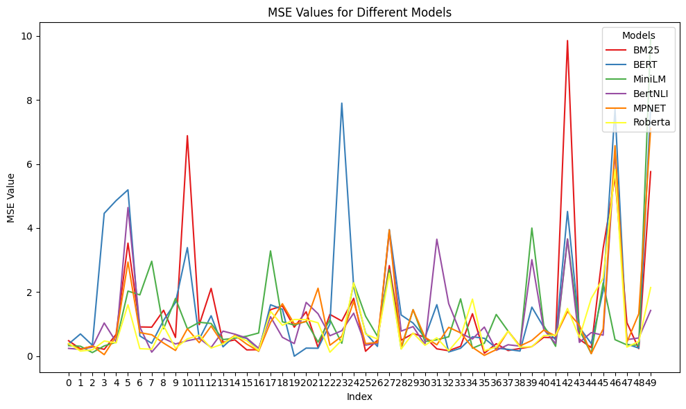
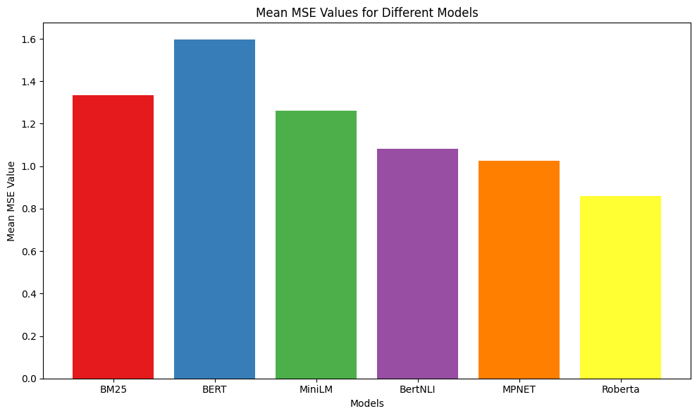

# Machine Learning for Natural Language Processing  
## **TripAdvisor Recommendation Challenge**  
**Authors:** Michele Pulvirenti, Marco Riva  
**Date:** November 2024  

[See the full project report (PDF)](./Report_Project1.pdf)
---

## **1. Introduction**  
This project focuses on building a recommendation system leveraging TripAdvisor reviews. Starting with a BM25 baseline, the analysis explores advanced NLP models to enhance recommendation performance. Key steps include preprocessing, model evaluation, and the implementation of an ensemble strategy to combine predictions from different models.

---

## **2. Data Preprocessing**  

### **2.1 Preparation**  
- Columns irrelevant to ratings and reviews were removed.  
- Reviews with missing values were excluded.  

### **2.2 Language**  
- Over 90% of reviews were in English. Non-English reviews were detected using `fast-langdetect` for efficient and accurate language detection.  

### **2.3 Transformation**  
Text preprocessing steps (using NLTK):  
- **Lowercasing:** Standardizing text.  
- **Tokenization:** Splitting text into words.  
- **Removing Punctuation and Stopwords:** Filtering unnecessary tokens.  
- **Lemmatization:** Reducing words to base forms.  

---

## **3. Model Testing**  

### **3.1 Approach**  
- A fixed set of 50 randomly selected reviews was used as queries.  
- Models predicted the most similar hotels based on review text, evaluated using Mean Squared Error (MSE).  

### **3.2 Models**  
#### **3.2.1 Baseline: BM25**  
- Implemented with `rank-bm25`.  
- Scores based on term frequency (TF), inverse document frequency (IDF), and document length.  

#### **3.2.2 BERT**  
- Pre-trained `bert-base-uncased`.  
- Cosine similarity between averaged embeddings used for recommendation.  

#### **3.2.3 Sentence Transformers**  
Several variants tested:  
- **MiniLM:** Lightweight and fast.  
- **BertNLI:** Fine-tuned for natural language inference.  
- **MPNET:** Contextually advanced.  
- **Roberta:** Best performer for semantic similarity.  

---

## **4. Results**  

- **Roberta:** Achieved the lowest average MSE (0.86), outperforming BERT and BM25.  
- Sentence transformers demonstrated significant gains over the baseline.  

---

## **5. Ensemble Learning**  
- Combined predictions from all models.  
- Best-performing model per query selected based on MSE.  

**Example Results:**  
| Query ID | Best Model | Best MSE |  
|----------|------------|----------|  
| 111507   | MPNET      | 0.05     |  
| 93517    | MiniLM     | 0.11     |  
| 93340    | Roberta    | 0.16     |  

---

## **6. Conclusion**  
- Transformer models (e.g., Roberta) excel in capturing semantic nuances.  
- Preprocessing and embedding efficiency are critical to scalability.  
- Ensemble methods further enhance recommendation accuracy.  

---

## **7. Delivery**  
- Intermediate results (e.g., datasets, embeddings) stored to facilitate reproducibility.  
- Code structured to automate retrieval of precomputed artifacts, minimizing computational overhead.

